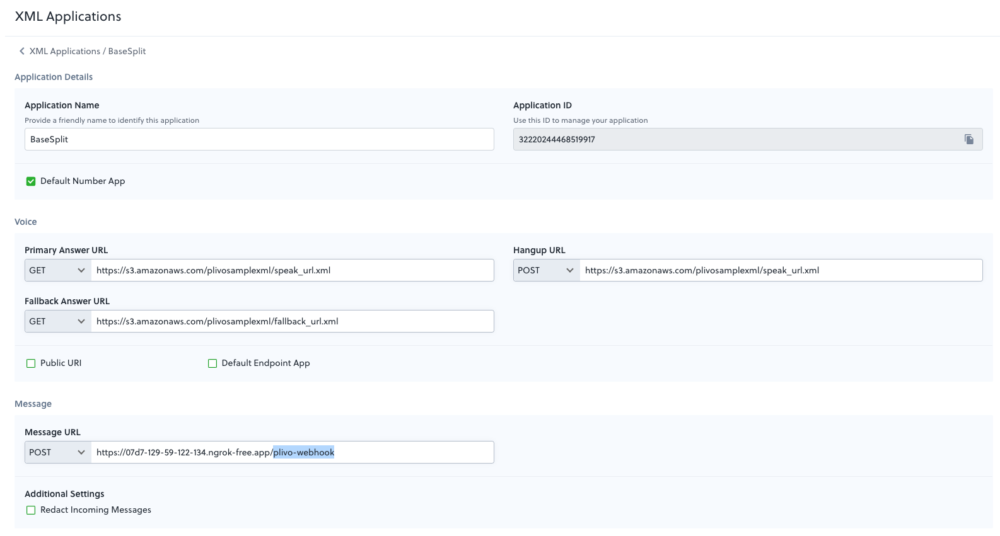

# BaseSplit

BaseSplit is a smart bill-splitting tool that streamlines the process of sharing expenses with friends. Simply snap a photo of your physical bill, send it through iMessage, and BaseSplit automatically processes the image to generate and send cryptocurrency payment requests to your friends. With its automated workflow and crypto integration, BaseSplit makes splitting bills hassle-free and modern.

## How it works

TODO: fill in as we go

## Setup

1. We use `uv` as the dependency manager. If you don't have it installed, you can install it with `brew install uv` or other ways following the instructions [here](https://docs.astral.sh/uv/).

2. Run `uv sync` to get started

3. Activate the virtual env. On mac/ubuntu run `source .venv/bin/activate` and on windows run `.\.venv\Scripts\activate`

## Development and Testing

1. Start the server with `python plivo_message.py`
2. On another terminal (for local testing), run `ngrok http 5001`. The output should contain a forwarding URL, for example `https://07d7-129-59-122-134.ngrok-free.app`. Append `plivo-webhook` to the end of the URL, so it becomes `https://07d7-129-59-122-134.ngrok-free.app/plivo-webhook`. 
3. Go to the [Plivo Dashboard](https://console.plivo.com/) and create a new application with a MMS-enabled phone number. On the right-hand sidebar, click on `Messaging` > `Applications` > `XML`. See the image below for reference. NOTE: since we're using the free version of ngrok, the URL will change every time you restart ngrok so you'll have to update the URL in the Plivo dashboard.

4. Send an image to the phone number you just set up. You should receive a response with the receipt data in flask server logs. 

